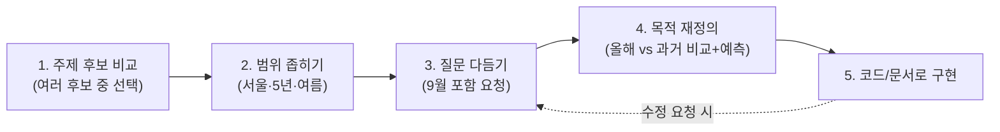

# 📚 초보자를 위한 종합 학습서

> 이 문서는 처음 데이터 분석을 배우는 사람을 위해, 이 프로젝트를 하나의 학습 여정으로 정리한 문서입니다. 실습 코드는 `TUTORIAL.md`, 실행 방법은 `FILE_GUIDE.md`를 함께 참고하세요.

## 🧭 이 문서를 읽는 순서

```
1. 우리가 무엇을 배우기로 했는가 (미션 목표 되짚기)
        ↓
2. 우리가 실제로 밟은 5단계 학습 여정 (대화 요약)
        ↓
3. 핵심 개념 7가지 (초보자 눈높이 설명)
        ↓
4. 데이터 분석 사고력을 기르는 3가지 습관
        ↓
5. 스스로 점검하는 자가진단 질문
        ↓
6. 다음에 무엇을 하면 좋을지
```

## 1️⃣ 우리가 무엇을 배우기로 했는가

이 프로젝트는 아래 3가지 역량을 기르기 위해 설계되었습니다.

| 역량 | 이 프로젝트에서 해당하는 부분 |
| :--- | :--- |
| ① 데이터 분석 사고 | 질문 3개 정의 → 실측 데이터로 검증 → 관찰/해석 구분 (`README.md` 2장, `REPORT.md` 7장) |
| ② 시계열 데이터 이해 | 트렌드/계절성, 이동평균 대신 편차·감쇄 기법 활용 (`ANALYSIS_EXPLANATION.md`) |
| ③ AI 활용 역량 | AI에게 코드 작성을 맡기고 결과를 직접 실행·검증하기 (`REPORT.md` 8장) |

즉 이 프로젝트의 목적은 "예쁜 그래프를 그리는 것"이 아니라, 위 3가지를 몸으로 익히는 것입니다.

## 2️⃣ 우리가 실제로 밟은 5단계 학습 여정

이 프로젝트의 주제는 순서대로 딱 떨어지지 않고, **왔다 갔다 하며 다듬어지는 과정**을 거쳐 확정되었습니다(전체 대화는 `README.md` 3장 참고).



- **왜 이 순서가 중요한가?**: 처음부터 완벽한 계획을 세우고 시작한 게 아니라, "일단 골라보고 → 좁혀보고 → 실제로 뭘 알고 싶은지 다시 생각해보는" 과정을 거쳤습니다. 실제 데이터 분석 업무도 이렇게 **질문이 점점 뾰족해지는 반복 과정**입니다.

## 3️⃣ 핵심 개념 7가지 (초보자 눈높이 설명)

### ① 시계열 데이터 (Time Series Data)
시간 순서대로 나열된 데이터. 예: 매일의 기온, 매달의 주가. **순서가 바뀌면 의미가 완전히 달라진다**는 점이 일반 데이터와 다릅니다.

### ② 트렌드 (Trend)
장기적으로 값이 오르거나 내려가는 큰 흐름. 이 프로젝트에서는 폭염일수가 2021년 18일 → 2024년 27일로 늘었다가 2026년 다시 15일로 꺾이는 것을 확인했습니다. 6년치 데이터만으로는 명확한 상승/하강 트렌드를 단정할 수 없다는 것 자체가 배울 점입니다 — `REPORT.md` 9장 한계점 참고.

### ③ 계절성 (Seasonality)
일정한 주기로 반복되는 패턴. 매년 6월에 시작해 8월에 정점을 찍고 9월에 내려가는 기온 곡선이 대표적입니다.

### ④ 노이즈 (Noise)
트렌드와 계절성으로 설명되지 않는 하루하루의 미세한 오르내림. `02_timeline_and_forecast.png`에서 실측 기온 실선이 매끈한 곡선이 아니라 매일 들쭉날쭉한 것이 노이즈입니다(예: 6/16·6/19처럼 계절 흐름과 무관하게 하루 이틀 튀는 날). **노이즈가 있다고 데이터가 잘못된 게 아니라, 원래 현실이 그렇습니다.** 노이즈와 트렌드/계절성을 구분하려면 "여러 날에 걸쳐 반복되는 패턴인가(트렌드·계절성), 하루이틀의 일시적 변동인가(노이즈)"를 기준으로 보면 됩니다.

### ⑤ 결측치와 보간 (Missing Value & Interpolation)
관측이 누락된 값. 이 프로젝트는 선형보간(전후 값을 직선으로 이음)으로 처리했습니다 — `ANALYSIS_EXPLANATION.md` 3장 참고.

### ⑥ 편차(Anomaly)
"오늘 값 − 평년 평균값". 절대 기온보다 "평소보다 얼마나 이례적인지"를 더 잘 보여줍니다. `03_monthly_anomaly_heatmap.png`에서 색이 진할수록 편차가 큽니다. 절대값(28℃)보다 편차(예: 2024년 8월 +2.06℃)가 "평소보다 얼마나 이례적인지"를 더 잘 보여줍니다.

### ⑦ 관찰(Fact) vs 해석(가설)
- **관찰**: 그래프/숫자에서 눈으로 확인할 수 있는 사실. 예: "2026년 폭염일수는 15일이다."
- **해석**: 그 관찰에 대한 나의 추정. 예: "2026년 여름이 온건했던 것은 7월이 선선했기 때문일 가능성이 있다." — 해석은 **틀릴 수도 있는 가설**이므로, 반드시 "~로 추정된다", "~일 가능성이 있다"처럼 단정하지 않는 표현을 씁니다. `REPORT.md` 7장에서 이 구분을 실제로 어떻게 적용했는지 확인해 보세요.

## 4️⃣ 데이터 분석 사고력을 기르는 3가지 습관

1. **"그래서 이게 무슨 의미인가?"를 항상 스스로에게 되묻기**
   숫자 하나를 봤을 때 "높다/낮다"에서 멈추지 말고, "왜 높아졌을까?", "이게 다른 지표와 관련 있을까?"까지 생각해보는 습관.

2. **숫자를 비교 기준 없이 보지 않기**
   "2026년 폭염 15일"은 그 자체로는 의미가 약합니다. "과거 5개년 평균 20.2일과 비교하면 -5.2일"처럼 **비교 대상**이 있어야 "이번 여름이 예년보다 온건했다"는 의미가 살아납니다.

3. **가설이 데이터와 안 맞으면, 가설을 버리기**
   이 프로젝트가 참고한 이전 세션에서는 코드로 만든 가짜(합성) 데이터를 사용해 "역대급 폭염 시즌"이라는 결론을 냈습니다. 하지만 기상청 실측 데이터로 교체하자 정반대에 가까운 그림이 나왔습니다 — 폭염일수는 오히려 과거 5개년 평균보다 적었습니다(`REPORT.md` Executive Summary 참고). **좋은 분석가는 "그럴듯한 이야기"보다 실측 데이터를 우선하고, 데이터가 예상과 다르면 서사가 아니라 가설을 수정합니다.**

## 5️⃣ 스스로 점검하는 자가진단 질문

아래 질문에 이 프로젝트 파일들을 보지 않고 스스로 답해보세요. 막히는 항목이 있으면 괄호 안의 파일을 열어 확인하세요.

**기본 이해**

1. 이 프로젝트의 분석 질문 3가지는 무엇이었나요? *(`README.md` 2장)*
2. 폭염과 열대야는 각각 몇 ℃를 기준으로 나누나요? *(`ANALYSIS_EXPLANATION.md` 2장)*
3. `df[(df["year"]==2026) & (df["max_temp"]>=33.0)]` 코드는 무엇을 필터링하는 코드인가요? *(`TUTORIAL.md`)*
4. "관찰"과 "해석"의 차이를 한 문장으로 설명할 수 있나요? *(위 3장 ⑦)*

**과정을 남에게 설명하기**

5. 데이터를 로딩 → 정제 → 분석 → 시각화하는 전체 흐름을, 각 단계가 어떤 코드/함수가 담당하는지 포함해서 순서대로 설명할 수 있나요? *(`ANALYSIS_EXPLANATION.md` 1장)*
6. 결측치를 왜 삭제하거나 평균으로 채우지 않고 선형보간으로 처리했는지, 그 이유를 설명할 수 있나요? *(`ANALYSIS_EXPLANATION.md` 3장)*
7. 히트맵(차트 3)은 왜 일별이 아니라 월별로 집계했는지 설명할 수 있나요? 반대로 타임라인(차트 2)은 왜 일별을 그대로 썼을까요? *(`ANALYSIS_EXPLANATION.md` 5장 "집계 단위와 각 기법이 보려는 것")*

**기법과 근거를 스스로 재구성하기**

8. 편차(anomaly)와 감쇄(decay) 예측이 각각 "무엇을 보려는 기법"인지 한 문장씩 설명할 수 있나요? *(`ANALYSIS_EXPLANATION.md` 4·5장)*
9. 노이즈와 트렌드를 그래프에서 어떻게 구분하나요? *(위 3장 ④)*
10. 이 프로젝트의 결론("온건한 여름")이 왜 8월과 7월에서 다르게 나타나는지 설명할 수 있나요? *(`REPORT.md` 3.3절, 7장 인사이트 3)*
11. 인사이트 1개를 골라 "관찰(Fact) → 해석(Why) → 행동/제안(Action)" 흐름으로 직접 말해볼 수 있나요? *(`REPORT.md` 7장)*
12. 만약 "여름"을 6~8월이 아니라 7~9월로 다시 정의했다면 결론이 어떻게 달라졌을지 설명할 수 있나요? *(`REPORT.md` 7장 "반례 검토")*
13. `REPORT.md`의 "AI 사용 로그"를 보지 않고, 이 프로젝트의 핵심 결론(2026년 여름이 왜 온건했다고 판단했는지)을 AI 없이 본인 말로 요약할 수 있나요?

열세 문제 모두 막힘없이 답할 수 있다면, 이 미션의 「과제 목표」 3가지를 충분히 달성한 것입니다.

## 6️⃣ 다음에 무엇을 하면 좋을지

| 하고 싶은 것 | 참고 문서 |
| :--- | :--- |
| 코드를 직접 실행하고 결과를 눈으로 보고 싶다 | `FILE_GUIDE.md` |
| 판다스 문법을 하나씩 따라 치며 익히고 싶다 | `TUTORIAL.md` → `tutorial_practice.py` |
| 수식과 차트 해석을 더 깊이 이해하고 싶다 | `ANALYSIS_EXPLANATION.md` |
| 9월 예측(폭염 0일)이 실제로 맞았는지 확인하고 싶다 | 9월이 지난 뒤 `./run.sh fetch`로 재수집 후 `REPORT.md`와 비교 (`README.md` 9장 향후 발전 과제 1번) |

**한 줄 정리**: 이 프로젝트는 "그래프 그리기"가 아니라 "질문을 다듬고, 근거를 대며 해석하고, 한계를 인정하는 연습"이었습니다. 다음 프로젝트에서는 이 5가지 습관(질문 정의 → 데이터 확인 → 관찰/해석 구분 → 비교 기준 마련 → 한계 인정)을 그대로 다른 주제에 적용해 보세요.
