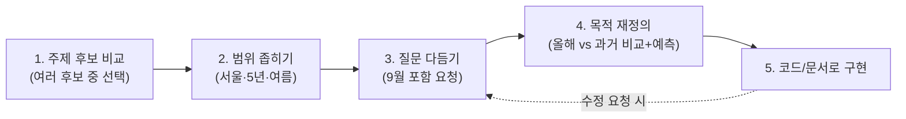

# 📚 초보자를 위한 종합 학습서

> 이 문서는 처음 데이터 분석을 배우는 사람을 위해, 이 프로젝트를 하나의 학습 여정으로 정리한 문서입니다. 실습 코드는 `TUTORIAL.md`, 실행 방법은 `FILE_GUIDE.md`를 함께 참고하세요.

## 🧭 이 문서를 읽는 순서

```
1. 우리가 무엇을 배우기로 했는가 (미션 목표 되짚기)
        ↓
2. 우리가 실제로 밟은 5단계 학습 여정 (대화 요약)
        ↓
3. 핵심 개념 7가지 (초보자 눈높이 설명)
        ↓
4. 데이터 분석 사고력을 기르는 3가지 습관
        ↓
5. 스스로 점검하는 자가진단 질문
        ↓
6. 다음에 무엇을 하면 좋을지
        ↓
부록. 미션 평가 루브릭 자가 점검 (질문 + 답변)
```

## 1️⃣ 우리가 무엇을 배우기로 했는가

이 프로젝트는 아래 3가지 역량을 기르기 위해 설계되었습니다.

| 역량 | 이 프로젝트에서 해당하는 부분 |
| :--- | :--- |
| ① 데이터 분석 사고 | 질문 3개 정의 → 실측 데이터로 검증 → 관찰/해석 구분 (`README.md` 2장, `REPORT.md` 7장) |
| ② 시계열 데이터 이해 | 트렌드/계절성, 이동평균 대신 편차·감쇄 기법 활용 (`ANALYSIS_EXPLANATION.md`) |
| ③ AI 활용 역량 | AI에게 코드 작성을 맡기고 결과를 직접 실행·검증하기 (`REPORT.md` 8장) |

즉 이 프로젝트의 목적은 "예쁜 그래프를 그리는 것"이 아니라, 위 3가지를 몸으로 익히는 것입니다.

## 2️⃣ 우리가 실제로 밟은 5단계 학습 여정

이 프로젝트의 주제는 순서대로 딱 떨어지지 않고, **왔다 갔다 하며 다듬어지는 과정**을 거쳐 확정되었습니다(전체 대화는 `README.md` 3장 참고).



- **왜 이 순서가 중요한가?**: 처음부터 완벽한 계획을 세우고 시작한 게 아니라, "일단 골라보고 → 좁혀보고 → 실제로 뭘 알고 싶은지 다시 생각해보는" 과정을 거쳤습니다. 실제 데이터 분석 업무도 이렇게 **질문이 점점 뾰족해지는 반복 과정**입니다.

## 3️⃣ 핵심 개념 7가지 (초보자 눈높이 설명)

### ① 시계열 데이터 (Time Series Data)
시간 순서대로 나열된 데이터. 예: 매일의 기온, 매달의 주가. **순서가 바뀌면 의미가 완전히 달라진다**는 점이 일반 데이터와 다릅니다.

### ② 트렌드 (Trend)
장기적으로 값이 오르거나 내려가는 큰 흐름. 이 프로젝트에서는 폭염일수가 2021년 18일 → 2024년 27일로 늘었다가 2026년 다시 15일로 꺾이는 것을 확인했습니다. 6년치 데이터만으로는 명확한 상승/하강 트렌드를 단정할 수 없다는 것 자체가 배울 점입니다 — `REPORT.md` 9장 한계점 참고.

### ③ 계절성 (Seasonality)
일정한 주기로 반복되는 패턴. 매년 6월에 시작해 8월에 정점을 찍고 9월에 내려가는 기온 곡선이 대표적입니다.

### ④ 노이즈 (Noise)
트렌드와 계절성으로 설명되지 않는 하루하루의 미세한 오르내림. `02_timeline_and_forecast.png`에서 실측 기온 실선이 매끈한 곡선이 아니라 매일 들쭉날쭉한 것이 노이즈입니다(예: 6/16·6/19처럼 계절 흐름과 무관하게 하루 이틀 튀는 날). **노이즈가 있다고 데이터가 잘못된 게 아니라, 원래 현실이 그렇습니다.** 노이즈와 트렌드/계절성을 구분하려면 "여러 날에 걸쳐 반복되는 패턴인가(트렌드·계절성), 하루이틀의 일시적 변동인가(노이즈)"를 기준으로 보면 됩니다.

### ⑤ 결측치와 보간 (Missing Value & Interpolation)
관측이 누락된 값. 이 프로젝트는 선형보간(전후 값을 직선으로 이음)으로 처리했습니다 — `ANALYSIS_EXPLANATION.md` 3장 참고.

### ⑥ 편차(Anomaly)
"오늘 값 − 평년 평균값". 절대 기온보다 "평소보다 얼마나 이례적인지"를 더 잘 보여줍니다. `03_monthly_anomaly_heatmap.png`에서 색이 진할수록 편차가 큽니다. 절대값(28℃)보다 편차(예: 2024년 8월 +2.06℃)가 "평소보다 얼마나 이례적인지"를 더 잘 보여줍니다.

### ⑦ 관찰(Fact) vs 해석(가설)
- **관찰**: 그래프/숫자에서 눈으로 확인할 수 있는 사실. 예: "2026년 폭염일수는 15일이다."
- **해석**: 그 관찰에 대한 나의 추정. 예: "2026년 여름이 온건했던 것은 7월이 선선했기 때문일 가능성이 있다." — 해석은 **틀릴 수도 있는 가설**이므로, 반드시 "~로 추정된다", "~일 가능성이 있다"처럼 단정하지 않는 표현을 씁니다. `REPORT.md` 7장에서 이 구분을 실제로 어떻게 적용했는지 확인해 보세요.

## 4️⃣ 데이터 분석 사고력을 기르는 3가지 습관

1. **"그래서 이게 무슨 의미인가?"를 항상 스스로에게 되묻기**
   숫자 하나를 봤을 때 "높다/낮다"에서 멈추지 말고, "왜 높아졌을까?", "이게 다른 지표와 관련 있을까?"까지 생각해보는 습관.

2. **숫자를 비교 기준 없이 보지 않기**
   "2026년 폭염 15일"은 그 자체로는 의미가 약합니다. "과거 5개년 평균 20.2일과 비교하면 -5.2일"처럼 **비교 대상**이 있어야 "이번 여름이 예년보다 온건했다"는 의미가 살아납니다.

3. **가설이 데이터와 안 맞으면, 가설을 버리기**
   이 프로젝트가 참고한 이전 세션에서는 코드로 만든 가짜(합성) 데이터를 사용해 "역대급 폭염 시즌"이라는 결론을 냈습니다. 하지만 기상청 실측 데이터로 교체하자 정반대에 가까운 그림이 나왔습니다 — 폭염일수는 오히려 과거 5개년 평균보다 적었습니다(`REPORT.md` Executive Summary 참고). **좋은 분석가는 "그럴듯한 이야기"보다 실측 데이터를 우선하고, 데이터가 예상과 다르면 서사가 아니라 가설을 수정합니다.**

## 5️⃣ 스스로 점검하는 자가진단 질문

아래 질문에 이 프로젝트 파일들을 보지 않고 스스로 답해보세요. 막히는 항목이 있으면 괄호 안의 파일을 열어 확인하세요.

**기본 이해**

1. 이 프로젝트의 분석 질문 3가지는 무엇이었나요? *(`README.md` 2장)*
2. 폭염과 열대야는 각각 몇 ℃를 기준으로 나누나요? *(`ANALYSIS_EXPLANATION.md` 2장)*
3. `df[(df["year"]==2026) & (df["max_temp"]>=33.0)]` 코드는 무엇을 필터링하는 코드인가요? *(`TUTORIAL.md`)*
4. "관찰"과 "해석"의 차이를 한 문장으로 설명할 수 있나요? *(위 3장 ⑦)*

**과정을 남에게 설명하기**

5. 데이터를 로딩 → 정제 → 분석 → 시각화하는 전체 흐름을, 각 단계가 어떤 코드/함수가 담당하는지 포함해서 순서대로 설명할 수 있나요? *(`ANALYSIS_EXPLANATION.md` 1장)*
6. 결측치를 왜 삭제하거나 평균으로 채우지 않고 선형보간으로 처리했는지, 그 이유를 설명할 수 있나요? *(`ANALYSIS_EXPLANATION.md` 3장)*
7. 히트맵(차트 3)은 왜 일별이 아니라 월별로 집계했는지 설명할 수 있나요? 반대로 타임라인(차트 2)은 왜 일별을 그대로 썼을까요? *(`ANALYSIS_EXPLANATION.md` 5장 "집계 단위와 각 기법이 보려는 것")*

**기법과 근거를 스스로 재구성하기**

8. 편차(anomaly)와 감쇄(decay) 예측이 각각 "무엇을 보려는 기법"인지 한 문장씩 설명할 수 있나요? *(`ANALYSIS_EXPLANATION.md` 4·5장)*
9. 노이즈와 트렌드를 그래프에서 어떻게 구분하나요? *(위 3장 ④)*
10. 이 프로젝트의 결론("온건한 여름")이 왜 8월과 7월에서 다르게 나타나는지 설명할 수 있나요? *(`REPORT.md` 3.3절, 7장 인사이트 3)*
11. 인사이트 1개를 골라 "관찰(Fact) → 해석(Why) → 행동/제안(Action)" 흐름으로 직접 말해볼 수 있나요? *(`REPORT.md` 7장)*
12. 만약 "여름"을 6~8월이 아니라 7~9월로 다시 정의했다면 결론이 어떻게 달라졌을지 설명할 수 있나요? *(`REPORT.md` 7장 "반례 검토")*
13. `REPORT.md`의 "AI 사용 로그"를 보지 않고, 이 프로젝트의 핵심 결론(2026년 여름이 왜 온건했다고 판단했는지)을 AI 없이 본인 말로 요약할 수 있나요?

열세 문제 모두 막힘없이 답할 수 있다면, 이 미션의 「과제 목표」 3가지를 충분히 달성한 것입니다.

## 6️⃣ 다음에 무엇을 하면 좋을지

| 하고 싶은 것 | 참고 문서 |
| :--- | :--- |
| 코드를 직접 실행하고 결과를 눈으로 보고 싶다 | `FILE_GUIDE.md` |
| 판다스 문법을 하나씩 따라 치며 익히고 싶다 | `TUTORIAL.md` → `tutorial_practice.py` |
| 수식과 차트 해석을 더 깊이 이해하고 싶다 | `ANALYSIS_EXPLANATION.md` |
| 9월 예측(폭염 0일)이 실제로 맞았는지 확인하고 싶다 | 9월이 지난 뒤 `./run.sh fetch`로 재수집 후 `REPORT.md`와 비교 (`README.md` 9장 향후 발전 과제 1번) |

**한 줄 정리**: 이 프로젝트는 "그래프 그리기"가 아니라 "질문을 다듬고, 근거를 대며 해석하고, 한계를 인정하는 연습"이었습니다. 다음 프로젝트에서는 이 5가지 습관(질문 정의 → 데이터 확인 → 관찰/해석 구분 → 비교 기준 마련 → 한계 인정)을 그대로 다른 주제에 적용해 보세요.

---

## 📋 부록: 미션 평가 루브릭 자가 점검 (질문 + 답변)

위 5장의 자가진단이 "혼자 답해보기"용이었다면, 이 부록은 실제 평가 루브릭 문항에 **이 프로젝트를 근거로 채운 답변**입니다. 스스로 답해본 뒤 아래와 비교하거나, 바로 답안으로 참고해도 됩니다.

### 항목 1 — 산출물이 요구사항을 충족하는가

| 질문 | 답변 |
| :--- | :--- |
| 시계열 데이터가 100개 이상의 데이터 포인트를 포함하고 있는가? | **예.** 총 582개(`data/summer_climate.csv` 552행 + `data/september_forecast.csv` 30행), 기상청 ASOS 서울(108) 실측/예측치 |
| 분석 질문이 3개 이상 명확하게 정의되어 있는가? | **예.** `README.md` 2장에 3개(연도별 기온 추세 / 극한 기후 분석 / 9월 늦더위 전이) 정의 |
| 시계열 분석 기법(예: 이동평균/변화율/구간 통계 등) 2가지 이상 결과가 리포트에 포함되어 있는가? | **예, 4가지.** 연도별·월별 집계(구간 통계), 평년 대비 편차(Anomaly), 연도별 누적합, 평년값+감쇄(Decay) 기반 예측 — `docs/REPORT.md` 3~6장, `docs/ANALYSIS_EXPLANATION.md` |
| 시각화가 필수 2개 이상 포함되어 있는가? | **예, 4개.**(막대/타임라인/히트맵/누적곡선) `images/`, `docs/REPORT.md` 3~6장에 임베드 |
| 권장 시각화 1개를 추가해 총 3개 이상을 구성했는가? (권장) | **예.** 필수 기준(2개)을 넘어 4개로 권장 기준(3개 이상)도 충족 |
| 인사이트가 3개 이상이며, 각 인사이트에 관찰 근거(수치/구간)가 포함되어 있는가? | **예, 4개.** 각 인사이트가 "관찰(Fact)" 항목에 구체 수치(예: 폭염 15일 vs 과거평균 20.2일)를 명시 — `docs/REPORT.md` 7장 |
| GitHub 저장소에 코드, 리포트, 실행/데이터 출처 정보가 제공되어 있는가? | **예.** 이 저장소 자체(`fetch_kma_data.py`/`analysis.py`, `docs/REPORT.md`, `README.md`의 출처·실행 방법) |

### 항목 2 — 데이터 처리 과정을 설명할 수 있는가

**Q. 데이터 로딩/정제/분석/시각화 흐름을 단계적으로 설명할 수 있는가?**
> ① 로딩: `fetch_kma_data.py::collect_observed()`가 기상청 API를 호출해 JSON 응답을 받는다 → ② 정제: 숫자 타입 변환, 결측치 1건을 선형보간으로 채움, 폭염/열대야 여부를 임계값으로 플래그화 → ③ 분석: `analysis.py`가 정제된 CSV를 읽어 `groupby`로 연도별·월별 집계, 평년 편차, 누적합을 계산 → ④ 시각화: matplotlib/seaborn으로 4개 차트를 그려 `images/`에 저장. (`docs/ANALYSIS_EXPLANATION.md` 1장)

**Q. 결측치/이상치 처리 기준을 "왜 그렇게 정했는지" 설명할 수 있는가?**
> 결측치(1건)는 삭제하면 날짜 연속성이 끊기고(누적합·연속 스트릭 계산에 영향), 전체 평균으로 채우면 그날 전후의 실제 기온 흐름을 무시하게 되므로, 전후 값을 직선으로 잇는 선형보간을 선택했다. 이상치(폭염·열대야급 고온)는 따로 제거하지 않았다 — 그 "튀는 값" 자체가 분석 대상이므로 삭제 대신 임계값(33℃/25℃) 기준의 범주형 플래그로 다뤘다. (`docs/ANALYSIS_EXPLANATION.md` 3장, `docs/REPORT.md` 2장)

**Q. 시각화에서 사용한 집계 단위(일/주/월 등)와 그 선택 이유를 설명할 수 있는가?**
> 막대그래프·타임라인·누적곡선은 일별 데이터를 그대로 썼다 — 폭염·열대야는 "그 하루가 기준을 넘었는가"로 판정되므로 월평균처럼 뭉개면 개별 폭염일이 사라지기 때문이다. 반대로 히트맵은 월별 평균으로 집계했다 — 일별 편차는 노이즈가 커서 6년×4개월을 한눈에 비교하기 어렵기 때문이다. (`docs/ANALYSIS_EXPLANATION.md` 5장 "집계 단위와 각 기법이 보려는 것")

### 항목 3 — 적용한 기법의 목적을 설명할 수 있는가

**Q. 적용한 시계열 기법이 "무엇을 보려는 것인지" 설명할 수 있는가?**
> 이 프로젝트는 이동평균 대신 **편차(Anomaly)**와 **감쇄(Decay) 예측**을 핵심 기법으로 썼다. 편차는 "그 시기가 평소(평년)보다 얼마나 이례적이었는지"를 절대 기온보다 더 잘 보여주려는 것이고, 감쇄 예측은 "올여름의 더운 기세가 9월 들어 언제쯤 꺾일지" 시점을 추정하려는 것이다. (`docs/ANALYSIS_EXPLANATION.md` 4·5장)

**Q. 트렌드/계절성/노이즈 중 최소 1개를 예로 들어, 그래프에서 어떻게 구분하려 했는지 설명할 수 있는가?**
> 노이즈를 예로 들면: `02_timeline_and_forecast.png`에서 6월 초부터 8월까지 완만하게 올라갔다 내려가는 전체 곡선 모양이 계절성이고, 그 위에 6/16·6/19처럼 계절 흐름과 무관하게 하루 이틀만 튀는 부분이 노이즈다. "여러 날에 걸쳐 반복되는 패턴인가(계절성) vs 하루이틀의 일시적 변동인가(노이즈)"로 구분한다. (위 3장 ④)

**Q. (AI 사용 시) AI가 만든 코드/해석을 어떤 방식으로 검증했는지 설명할 수 있는가?**
> 예를 들어 KMA API 호출 코드는 실제로 호출해 응답이 정상 코드로 오는지, 반환된 연도별 행 수가 맞는지 직접 카운트해 검증했다. 결측치 보간 로직은 `df.isna().sum()`으로 결측 건수(1건)를 직접 출력해 확인하고, 보간된 값이 전후일 값 사이인지 수동으로 대조했다. 리포트의 모든 수치는 `analysis.py` 실행 로그와 한 줄씩 대조했다. (`docs/REPORT.md` 8장 AI 사용 로그 표)

### 항목 4 — 인사이트를 깊이 있게 설명할 수 있는가

**Q. 인사이트 1개를 골라 "관찰(Fact) → 원인(Why) → 행동(Action)" 흐름으로 설명할 수 있는가?**
> 관찰: 6월과 8월의 평년 대비 편차(+0.42℃, +0.45℃)는 거의 같은데도, 폭염일수는 6월 2일 vs 8월 11일로 크게 다르다. 원인: 편차의 크기가 아니라 절대 기온이 임계값(33℃)을 넘는지가 폭염 판정 기준인데, 8월의 평년 기온(27.27℃)이 이미 임계값에 훨씬 가까워 같은 편차라도 넘기 쉽다. 행동: 평균값 비교만으로는 "위험한 날"을 놓칠 수 있으므로, 임계값에 가까운 달의 편차는 특히 주의 깊게 봐야 한다. (`docs/REPORT.md` 7장 인사이트 3)

**Q. 분석 결과가 달라질 수 있는 반례(다른 기간/다른 집계 단위/외부 변수 등) 1개 이상을 제시할 수 있는가?**
> "여름"을 6~8월이 아니라 7~9월로 재정의하면 2026년 평균기온은 26.25℃→26.10℃, 폭염일수는 15일→13일로 달라진다. "온건한 여름"이라는 결론의 방향 자체는 바뀌지 않지만, 구체적인 수치는 계절을 어떻게 정의하느냐에 따라 달라진다 — 즉 이 리포트의 결론이 "정확히 6~8월"이라는 정의에 부분적으로 의존한다. (`docs/REPORT.md` 7장 "반례 검토")

**Q. 이 분석의 한계점과, 다음 단계에서 추가로 수집/검증하면 좋은 데이터를 제안할 수 있는가?**
> 한계점: 6년치 데이터로는 장기 온난화 추세를 통계적으로 증명하기엔 표본이 짧고, 서울 한 지점만 봐서 지역별 편차를 반영하지 못했으며, 9월 예측은 실측이 아닌 통계적 추정치다(`docs/REPORT.md` 9장). 다음 단계 제안: ① 9월이 지나면 실측으로 예측을 검증하고, ② 10~30년 단위 장기 데이터를 추가 수집하며, ③ 7월이 왜 선선했는지 설명할 강수량·장마 데이터를 추가 수집한다(`README.md` 9장 향후 발전 과제).

**Q. "AI 사용 로그"에 적은 사용 이유와 검증 방법을 근거로, AI 없이도 핵심 결론을 본인 말로 재구성할 수 있는가?**
> 2026년 서울 여름은 평균기온만 보면 과거 5년과 거의 같았고, 폭염·열대야 일수는 오히려 과거 평균보다 적었다. 7월이 평년보다 유독 선선했던 것이 큰 이유였고, 8월 초(8/1~8/11)에 짧고 굵게 더위가 몰렸을 뿐 여름 전체로는 온건했다. 9월도 통계 모델상 늦더위 가능성은 낮게(0일) 나왔지만, 이는 실측이 아니라 평년값 기반 추정이라 9월이 지나면 검증이 필요하다.
