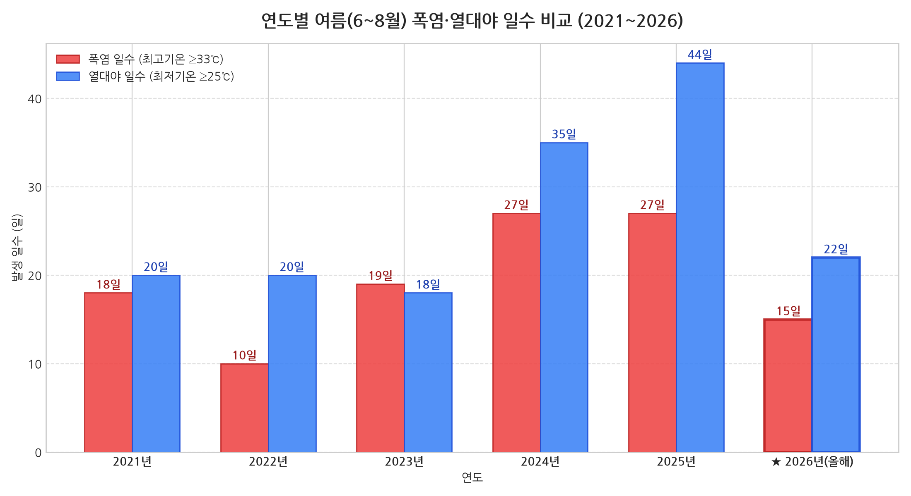
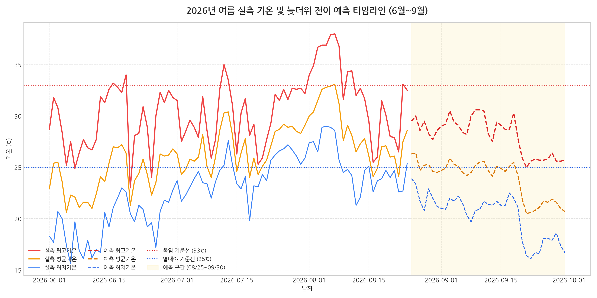
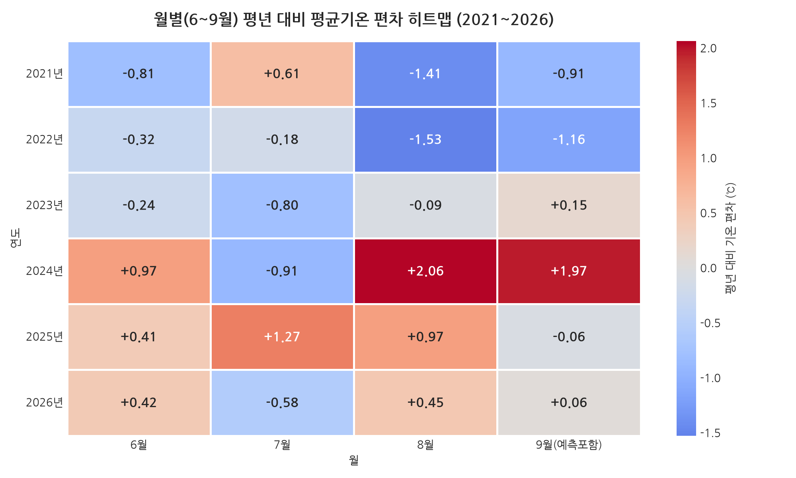
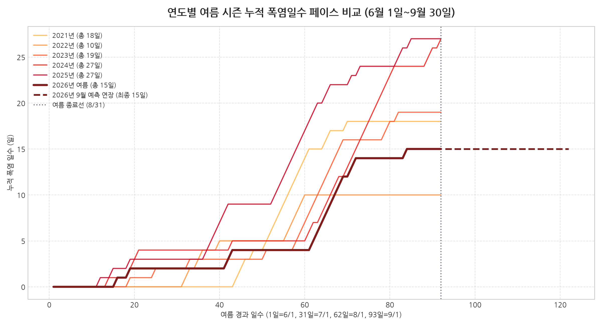

# 🌡️ 서울 여름 기후 비교 및 9월 늦더위 전이 예측 리포트

> **분석 기준일:** 2026년 8월 25일 (실측 2026-08-24까지 반영)
> **분석 대상 기간:** 2021~2025년 여름철(6/1~8/31) 실측 + 2026년 실측(6/1~8/24)·예측(8/25~9/30)
> **데이터 출처:** 기상청(KMA) ASOS 서울(지점번호 108) 일자료 — 공공데이터포털 `AsosDalyInfoService` API 실측치

## 📌 Executive Summary (요약)

1. **여름철 평균기온은 사실상 평년 수준**: 2026년(6~8월) 평균기온은 **26.25℃**로, 과거 5개년 평균(**26.16℃**) 대비 **+0.09℃**에 그쳤습니다. "역대급"이라 부를 만한 차이가 아닙니다.
2. **폭염 일수는 오히려 감소**: 2026년 폭염일수(최고기온 ≥33℃)는 **15일**로, 과거 5개년 평균(20.2일)보다 **5.2일 적고**, 2024·2025년(각 27일)의 절반 수준입니다.
3. **열대야 일수도 감소**: 2026년 열대야(최저기온 ≥25℃)는 **22일**로 과거 5개년 평균(27.4일)보다 **5.4일 적습니다.**
4. **월별로 뜯어보면 이야기가 다릅니다**: 6월(+0.42℃)과 8월(+0.45℃)은 평년보다 다소 더웠지만, **7월은 평년보다 뚜렷하게 선선**했습니다(-0.58℃). 폭염 15일 중 11일이 8월(그중 9일은 8/1~8/11에 집중)에 몰려 있고, 7월은 단 2일뿐이었습니다.
5. **역대 최고기온 공동 1위**: 6개년 통틀어 가장 더웠던 날은 **2025년 7월 27일**과 **2026년 8월 7일**로, 둘 다 최고기온 **38.0℃**를 기록했습니다.
6. **9월 늦더위 전망(모델 기반)**: 상순 평균 최고기온 약 29.3℃ → 하순 약 26.6℃로 낮아지며, 예측 모델상 폭염·열대야 추가 발생 일수는 **0일**로 산출되었습니다.

이 프로젝트가 참고한 이전 세션(`M1-1/test02`)에서는 처음에 코드로 생성한 합성 데이터로 "역대급 폭염"이라는 결론을 냈다가, 기상청 실측 데이터로 교체한 뒤 정반대에 가까운 결론으로 뒤집힌 시행착오가 있었습니다. 이 저장소는 그 교훈을 반영해 **처음부터 실측 데이터만으로** 분석을 다시 수행했습니다.

## ❓ 1. 분석 질문 (Analysis Questions)

이 프로젝트는 AI와 사용자의 대화를 거쳐 확정된 아래 3가지 질문에 답하기 위해 작성되었습니다. (질문이 다듬어진 과정은 `README.md` 3장 참고)

1. **[연도별 기온 추세]** 올해(2026년) 여름은 과거 5개년(2021~2025)과 비교할 때 실제로 더워졌는가? 얼마나 더워졌는가?
2. **[극한 기후 분석]** 폭염(최고기온 33℃↑)일수와 열대야(최저기온 25℃↑)일수는 5년 동안, 그리고 2026년에 어떻게 증감했는가?
3. **[9월 늦더위 전이]** 2026년 8월의 기세가 9월까지 이어질 것인가? 언제쯤 가을다운 기온으로 내려갈 것인가?

## 🗂️ 2. 데이터 설명

| 항목 | 내용 |
| :--- | :--- |
| 지역 | 서울특별시 (기상청 ASOS 지점번호 108) |
| 실측 기간 | 2021~2025년 매년 6/1~8/31 + 2026년 6/1~8/24 |
| 예측 기간 | 2026년 8/25~9/30 |
| 데이터 포인트 수 | 총 **582개** (여름 파일 552행 + 9월 예측 파일 30행, 미션 요구 기준 100개 이상 충족) |
| 수집 방법 | 공공데이터포털 "기상청_지상(종관, ASOS) 일자료 조회서비스" API를 `fetch_kma_data.py`로 호출 (재현 방법: `FILE_GUIDE.md` 참고) |
| 컬럼 | `date`, `year`, `month`, `day`, `day_of_year`, `avg_temp`(평균기온), `max_temp`(최고기온), `min_temp`(최저기온), `is_heatwave`, `is_tropical_night`, `type`(관측치/예측치) |
| 결측치 | **1건 발견** — 수집 과정에서 최저기온 값이 API 응답에 비어 있던 날이 있었음. 전후일의 **선형보간(linear interpolation)**으로 채움(수식과 선택 이유는 `ANALYSIS_EXPLANATION.md` 3장 참고). |
| 이상치 처리 | 별도 이상치 제거 없음. 폭염/열대야 같은 "튀는 값" 자체가 분석 대상이므로, 극값을 삭제하지 않고 임계값(33℃/25℃) 기준의 범주형 플래그로 다뤘습니다. |

> **데이터 성격 안내**: 2021~2025년 전 기간과 2026년 6/1~8/24는 기상청 **실측치**입니다. 2026년 8/25~9/30은 미래 시점이라 실측이 존재하지 않으므로, 과거 5개년의 달력일 평년값(climatology) + 2026년 여름 실측 구간의 평년 대비 편차를 감쇄시켜 반영한 **통계적 예측치**입니다. `type` 컬럼으로 두 성격을 구분해 두었습니다.

## 📊 3. 5개년(2021~2025) vs 2026년 여름철 비교 분석

### 3.1 연도별 여름 시즌(6~8월) 종합 지표

| 연도 | 평균기온 | 폭염일수 (≥33℃) | 열대야일수 (≥25℃) |
| :---: | :---: | :---: | :---: |
| **2021년** | 25.63℃ | 18일 | 20일 |
| **2022년** | 25.48℃ | 10일 | 20일 |
| **2023년** | 25.78℃ | 19일 | 18일 |
| **2024년** | 26.87℃ | 27일 | 35일 |
| **2025년** | 27.05℃ | 27일 | 44일 |
| **2026년 (올해)** | **26.25℃** | **15일** | **22일** |
| *과거 5개년 평균* | *26.16℃* | *20.2일* | *27.4일* |

### 3.2 핵심 지표 분석 (질문 1, 2 답변)

- **2021~2025년 추세**: 폭염일수는 2022년(10일)까지 낮았다가 2024~2025년(각 27일)에 뚜렷이 늘었습니다. 열대야일수도 2024~2025년에 급증(35일→44일)했습니다. 즉 **"매년 꾸준히 더워졌다"기보다는 2024년을 기점으로 계단식으로 뛰었다**는 편이 정확한 해석입니다.
- **2026년은 그 상승 흐름이 일단 꺾인 해**: 폭염 15일·열대야 22일은 2024~2025년보다 뚜렷이 낮고, 6년 중 두 번째로 온건한 해(가장 온건한 해는 2022년)입니다. 다만 평균기온(26.25℃)은 과거 5개년 평균보다는 여전히 근소하게 높습니다 — **"평균은 비슷하지만, 극단적으로 더운 날은 확실히 줄었다"**는 것이 2026년 여름의 정확한 특징입니다.

### 3.3 월별로 뜯어본 2026년 (7월이 예상을 깬 지점)

| 월 | 2026년 평균기온 | 과거 5개년 평균기온(편차) | 2026년 폭염일수 |
| :---: | :---: | :---: | :---: |
| 6월 | 24.05℃ | 23.63℃ (**+0.42**) | 2일 |
| 7월 | 26.92℃ | 27.51℃ (**-0.58**) | 2일 |
| 8월 | 27.72℃ | 27.27℃ (**+0.45**) | 11일 |

- 6월과 8월은 평년보다 더웠지만, **7월은 평년보다 뚜렷하게 선선**했습니다.
- 폭염일수 대부분(11/15일, 그중 9일은 8/1~8/11에 연속 집중)이 8월에 몰려 있고, 7월엔 단 2일뿐이었습니다. 이 "예상외로 시원했던 7월"이 없었다면 2026년 여름도 2024~2025년급 폭염 시즌에 가까워졌을 가능성이 있습니다.

## 📈 4. 올해 기온 궤적 및 9월 늦더위 예측 타임라인 (질문 3 답변)

### 4.1 올해 여름철 실측 기온 추이 (6/1~8/24)

- 6월 초는 평년 대비 서늘하게 출발했다가(6/1 최고 28.7℃) 6/16(33.2℃)·6/19(34.0℃)에 일시적으로 폭염 기준을 넘었습니다.
- 7월은 최고기온이 33℃를 넘긴 날이 단 2일(7/12, 7/13)뿐이었고, **8월 1일~11일 사이 9일에 걸쳐 33~38℃대 고온이 집중적으로 반복**되었습니다(정점은 8/7 38.0℃).

### 4.2 늦더위 전이 예측 (8/25~9/30, 통계 모델)

- **예측 초반(9월 상순)**: 최고기온 평균 약 **29.3℃**. 폭염 기준(33℃)에는 못 미치는 수준.
- **예측 하순(9월 하순)**: 최고기온 평균 약 **26.6℃**로 낮아지며 완만하게 가을 기온으로 전이.
- **모델이 예측한 9월 폭염/열대야 발생일수**: **0일 / 0일**. (실제 2024년 9월엔 폭염 6일·열대야 7일이 있었던 것과 대조적 — 근거는 5장 참고)

> ⚠️ 이 예측은 실제 수치예보 모델이 아니라, "과거 평년값 + 최근 관측 편차를 시간에 비례해 줄여 반영한다"는 단순 통계적 가정(감쇄 함수)에 기반한 **베이스라인 추정치**입니다. 태풍, 대기 순환 변화 같은 실제 기상 변수는 전혀 반영되지 않았습니다. 수식은 `ANALYSIS_EXPLANATION.md` 4장 참고.

## 🗺️ 5. 평년(2021~2025) 대비 기온 편차(Anomaly) 히트맵

- **2024년 8~9월**이 6년 통틀어 가장 두드러진 이상고온 구간이었습니다 (8월 +2.06℃, 9월 +1.97℃).
- **2022년 8월**은 가장 두드러진 이상저온 구간이었습니다 (-1.53℃).
- **2026년**은 6월(+0.42℃), 8월(+0.45℃)은 양의 편차, **7월(-0.58℃)은 음의 편차**로 나타나 "고르게 더운 해"라기보다 "월별로 편차가 엇갈린 해"에 가깝습니다.
- 참고로 9월 실측 데이터(2021~2025)를 보면, **2024년 9월에 실제로 폭염 6일·열대야 7일이 관측**되어 "9월 늦더위"가 완전히 가상의 시나리오가 아니라 실제로 있었던 현상임을 확인할 수 있습니다.

## 🏃 6. 누적 폭염일수 페이스 비교

- 2024~2025년 곡선은 여름 중반부터 가파르게 꺾여 올라가 시즌 말 27일에 도달합니다.
- 2026년(굵은 실선)은 **8월 초(8/1~8/11) 구간에서만 집중적으로 계단식 상승**하고 그 외에는 평평하게 이어지다 15일에서 멈췄으며, 9월 예측 구간(점선)에서도 추가 상승이 예측되지 않아 수평선으로 이어집니다.
- 2022년(총 10일)과 비교하면 2026년(15일)이 더 많지만, 2024~2025년(27일)과 비교하면 절반 수준입니다.

## 💡 7. 인사이트 (관찰·해석·행동 구조)

### 인사이트 1. "역대급 폭염" 가설은 실측 데이터로 뒷받침되지 않는다

- **관찰(Fact)**: 2026년 폭염일수 15일은 과거 5개년 평균(20.2일)보다 적고, 2024~2025년(각 27일)의 절반 수준이다.
- **해석(가설)**: 체감상 덥게 느껴졌다면 평균이 아니라 8/1~8/11의 연속 고온 구간(정점 38.0℃) 같은 특정 구간의 영향일 가능성이 있다.
- **행동/제안**: "이번 여름이 유독 덥게 느껴진 이유"를 더 파고들려면 습도·강수 데이터를 추가로 수집해 체감 요인을 분석해볼 수 있다(`README.md` 9장 향후 발전 과제).

### 인사이트 2. 폭염 증가는 "매년 조금씩"이 아니라 "2024년의 계단식 점프"였다

- **관찰(Fact)**: 폭염일수는 2021~2023년 10~19일 사이를 오가다, 2024년에 27일로 급증한 뒤 2025년에도 27일을 유지했다. 2026년은 다시 15일로 내려왔다.
- **해석(가설)**: 6년치 데이터만으로는 "온난화 추세"라고 단정하기 어렵다. 2024~2025년이 예외적으로 더운 2년이었을 가능성과, 2026년이 다시 예외적으로 온건한 해였을 가능성을 모두 열어둬야 한다.
- **행동/제안**: 최소 10~30년 이상의 장기 데이터를 확보해 통계적 추세 검정을 적용하면 더 신뢰할 수 있는 결론을 낼 수 있다(`README.md` 9장).

### 인사이트 3. 편차의 "크기"가 아니라 "기준선과의 거리"가 폭염 발생을 좌우한다

- **관찰(Fact)**: 6월(+0.42℃)과 8월(+0.45℃)의 평년 대비 편차는 거의 같은데도, 폭염일수는 6월 2일 vs 8월 11일로 크게 갈렸다.
- **해석(가설)**: 8월의 평년 평균기온(27.27℃)이 이미 폭염 기준(33℃)에 훨씬 가깝기 때문에, 같은 크기의 양의 편차라도 임계값을 넘기가 훨씬 쉽다. 반대로 7월은 -0.58℃의 음의 편차가 폭염일수를 2일까지 눌러, 여름 전체 폭염일수를 끌어내린 핵심 요인이 되었다.
- **행동/제안**: 평균값 비교만으로는 "위험한 날"을 놓칠 수 있으므로, 임계값에 가까운 달(예: 8월)의 편차는 특히 주의 깊게 봐야 한다.

### 인사이트 4. 9월 늦더위는 상상이 아니라 2024년에 실제로 있었던 현상이다

- **관찰(Fact)**: 2021~2023년 9월은 폭염·열대야가 0건이었지만, 2024년 9월엔 폭염 6일·열대야 7일이 실제로 관측되었다.
- **해석(가설)**: "늦더위"는 매년 반복되는 현상이 아니라, 그 해 여름의 기세에 따라 나타나거나 나타나지 않는 조건부 현상으로 보인다. 2026년은 여름 자체가 온건했기 때문에, 예측 모델도 9월 늦더위 가능성을 낮게(0일) 산출했다.
- **행동/제안**: 9월 예측치는 실측이 아니므로, 실제 9월이 되면 이 예측(폭염 0일)이 맞았는지 반드시 검증해봐야 한다(`README.md` 9장 향후 발전 과제 1번).

### 반례 검토 — "여름"의 정의를 바꾸면 결론이 달라지는가?

이 리포트는 "여름"을 기상청 표준대로 6~8월로 정의했습니다. 만약 대신 **7~9월**로 정의했다면 어떻게 달라졌을지 실제로 계산해봤습니다:

| 정의 | 2026년 평균기온 | 2026년 폭염일수 |
| :---: | :---: | :---: |
| 6~8월(본 리포트 기준) | 26.25℃ | 15일 |
| 7~9월(대안 정의) | 26.10℃ | 13일 |

**결론의 방향은 바뀌지 않습니다** — 6월(평균 2일 폭염, 평년보다 다소 더움)을 빼고 9월(예측상 폭염 0일, 평년보다 서늘함)을 더하면 평균기온과 폭염일수가 오히려 더 낮아져, "2026년 여름은 온건했다"는 결론이 약화되지 않고 오히려 조금 더 강화됩니다. 다만 **구체적인 수치(폭염 15일 vs 13일)는 계절을 어떻게 정의하느냐에 따라 달라진다**는 것을 보여주는 사례이며, 이는 이 분석의 결론이 "정확히 6~8월"이라는 정의에 부분적으로 의존한다는 것을 뜻합니다. 다른 집계 단위(예: 주 단위 집계)나 다른 지역(서울이 아닌 다른 도시) 데이터를 썼을 때도 결론이 얼마나 안정적인지는 별도로 검증이 필요합니다.

## 🤖 8. AI 사용 로그 (AI Usage Log)

| 사용 작업 | 사용 이유 | 검증 방법 |
| :--- | :--- | :--- |
| 주제 후보 브레인스토밍 및 질문 3가지 다듬기 | 초보자의 막막함을 줄이고, 대화를 통해 분석 범위를 단계적으로 좁히기 위해 | 사용자가 매 단계 직접 선택/수정 (`README.md` 3장 대화 기록) |
| KMA API 호출 스크립트 작성 (`fetch_kma_data.py`) | 공공데이터포털 API 스펙(파라미터, 응답 구조)을 빠르게 파악하고 재사용 가능한 수집 코드로 구현하기 위해 | 실제 API를 호출해 응답 정상 코드 확인, 반환된 5년치 데이터의 연도별 행 수를 직접 카운트해 검증 |
| 결측치 탐지 및 보간 로직 작성 | 500건 이상의 실측 데이터를 한 건씩 눈으로 확인하기 어려워, 프로그램으로 결측치를 자동 탐지하기 위해 | `df.isna().sum()`으로 결측 건수(1건)를 직접 출력 확인, 보간된 값이 전후일 값 사이인지 수동 대조 |
| 9월 감쇄 예측 모델 설계 및 코드 구현 | 감쇄 함수 등 통계 기법을 초보자가 이해할 수 있는 수준으로 구현하기 위해 | 코드 실행 결과(연도별 표, 예측 수치)를 리포트 표와 대조하여 수동 검증, 예측 로직의 가정을 리포트에 명시 |
| 4대 시각화 차트 코드 작성 | matplotlib/seaborn에 익숙하지 않은 초보자를 위한 완성 예시 제공 | 생성된 PNG 4개를 직접 열어 수치·범례·구간 표시가 실제 데이터와 일치하는지 육안 확인 |
| 리포트 수치·서술 검증 | `analysis.py` 실행 로그의 출력값과 리포트 문장이 정확히 일치하는지 확인하기 위해 | 실행 로그에 출력된 수치(평균기온 26.25℃, 폭염 15일 등)를 리포트 문장과 한 줄씩 대조 |

**한 줄 요약**: 이 프로젝트는 데이터 수집 코드·통계 계산·시각화·문서화 전 과정에서 AI의 도움을 받았지만, 모든 수치는 `analysis.py` 실행 로그와 대조해 사람이 직접 검증했습니다.

## 🧾 9. 결론 및 한계점

### 결론

2021~2026년 서울 여름철(6~8월) 기상청 실측 데이터를 분석한 결과, 2026년 여름은 평균기온만 놓고 보면 과거 5개년 평균보다 근소하게(+0.09℃) 높았지만, 폭염·열대야 일수는 오히려 과거 평균보다 적어 **"역대급 폭염 시즌"이라 부르기 어렵다**는 결론에 도달했습니다. 이는 월별로 뜯어봤을 때 7월이 평년보다 뚜렷하게 선선했기 때문으로 분석되며, 6월과 8월만 보면 평년보다 더웠습니다. 9월 늦더위 예측 모델은 2026년 8월까지의 온건한 기세를 반영해 폭염·열대야 발생 가능성을 낮게(0일) 산출했습니다.

### 한계점

1. **9월 예측(8/25~9/30)은 실측이 아니라 통계적 추정치입니다.** 실제 태풍, 대기 순환 변화 등은 반영되지 않았으므로, 실제 9월이 되면 반드시 실측과 비교 검증이 필요합니다.
2. **6년치 데이터만으로 장기 온난화 추세를 통계적으로 증명하기엔 표본이 짧습니다.** 최소 10~30년 단위 데이터가 있어야 기후학적 추세로 판단할 수 있습니다.
3. **단일 도시(서울) 데이터만 사용**하여 지역별 편차를 반영하지 못했습니다.
4. **폭염/열대야를 가르는 임계값(33℃/25℃)은 기상청의 공식 정의를 단순화한 값**이며, 실제 체감이나 지역별 기준과는 차이가 있을 수 있습니다.
5. **"7월이 왜 선선했는가"의 근본 원인(기압계 배치, 장마전선 위치 등)은 기온 데이터만으로는 설명할 수 없습니다.** 습도·강수량 등 원인 변수를 추가로 수집해야 더 정확히 설명할 수 있습니다.
6. **체감 온도는 이번 버전에서 다루지 않았습니다.** 습도·바람 등을 반영한 체감 분석은 이번 범위에서 제외했습니다.

## 🔬 부록: 보너스 심화 — STL 시계열 분해 및 예측 모델 백테스트

이 절은 미션 제출 이후 추가한 보너스 분석입니다. 본문 4장의 "평년값+편차감쇄" 예측 모델이 실제로 타당한지, 두 가지 방식으로 검증했습니다(`timeseries_advanced.py`, `./run.sh timeseries`).

**① STL 분해**: 5개년(2021~2025) 여름 사이클(6/1~9/30, 122일씩)을 이어붙여 추세·계절성·잔차로 분리한 결과, 5년 사이 여름철 기저 기온이 **+1.15℃** 상승하는 추세가 확인되었고(2장의 "6년치로는 온난화 추세를 단정하기 어렵다"는 한계점과 일관됨 — 상승은 관찰되지만 표본이 짧아 통계적으로 확정할 수는 없음), 여름 내 계절 곡선의 진폭은 **12.34℃**, 계절·추세로 설명 안 되는 날씨 노이즈(잔차)의 표준편차는 **1.67℃**로 나타났습니다.

**② 예측 모델 백테스트**: 본문의 베이스라인 모델과 더 정교해 보이는 Holt 지수평활 모델을, 5개년 leave-one-year-out 방식으로 정면 비교했습니다.

| 모델 | 5개년 평균 MAE |
| :--- | :---: |
| 베이스라인(평년값+편차감쇄, 본문 4장) | **1.64℃** (더 정확) |
| Holt 지수평활(통계적으로 더 정교한 대안) | 2.73℃ |

**핵심 발견**: 더 정교한 통계 모델(Holt)이 오히려 더 부정확했습니다. Holt는 계절성이 없는 순수 추세 모델이라, 6~8월의 "상승 국면"을 그대로 9월까지 연장해버려 실제로는 하강해야 할 9월 기온을 계속 오르는 것으로 예측했습니다(2026년 9월 열대야를 24일로 과대 예측 — 베이스라인·실제 기후 패턴은 0일에 수렴). 반면 베이스라인은 평년값을 기준점으로 삼기 때문에 계절 전환을 몰라도 구조적으로 안전합니다. **"모델이 정교할수록 정확하다"는 직관이 이 문제에서는 실측 백테스트로 반증되었으며**, 본문 4장에서 더 단순한 베이스라인 모델을 채택한 선택이 정량적으로 타당했음을 뒷받침합니다.

상세 수치·해석은 `docs/ANALYSIS_EXPLANATION.md` 7장, 시각화는 `images/05_stl_decomposition.png`·`images/06_forecast_backtest_comparison.png`, 원본 데이터는 `data/forecast_backtest_results.csv`·`data/september_forecast_model_comparison.csv`를 참고하세요.
